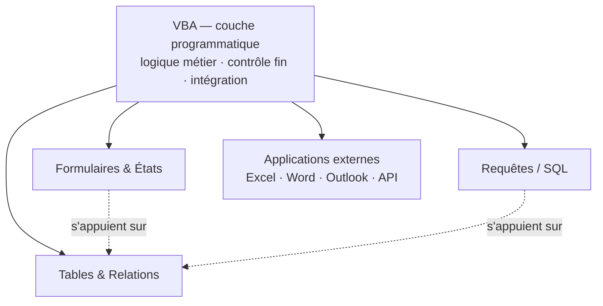

🔝 Retour au [Sommaire](/SOMMAIRE.md)

# 1.1. VBA dans l'écosystème Access — rôle et positionnement

Le chapitre précédent a présenté Access comme une plateforme hybride, à la fois moteur de base de données et environnement de développement. Cette première section précise un point essentiel : **quelle est exactement la place de VBA dans cet ensemble ?** Comprendre son positionnement, c'est savoir à quel moment il devient l'outil approprié — et, tout aussi important, à quel moment d'autres mécanismes d'Access suffisent.

VBA n'est ni le seul ni toujours le meilleur moyen d'agir dans Access. Il s'inscrit au sein d'un écosystème riche où plusieurs outils coexistent, du plus simple au plus puissant. Bien le situer évite deux écueils symétriques : tout vouloir programmer alors que des outils intégrés feraient l'affaire, ou au contraire se priver de VBA là où il est réellement indispensable.

## Qu'est-ce que VBA, précisément ?

VBA, pour *Visual Basic for Applications*, est un langage de programmation intégré à la suite Microsoft Office. Il dérive de Visual Basic 6 et en partage la syntaxe, mais il ne s'exécute pas de façon autonome : il vit **à l'intérieur** d'une application hôte — ici Access — dont il pilote le modèle objet.

Ce caractère « hébergé » a deux conséquences importantes. D'une part, VBA dispose du même éditeur (le VBE, *Visual Basic Editor*, accessible par <kbd>Alt</kbd>+<kbd>F11</kbd>) et du même langage de base dans toutes les applications Office ; vos connaissances du langage lui-même sont donc largement transférables d'Excel à Access. D'autre part, ce que VBA permet de *faire* dépend entièrement de l'hôte : dans Access, il manipule des formulaires, des états, des recordsets et des requêtes, là où dans Excel il manipule des feuilles, des plages et des classeurs. Le langage est commun ; le terrain de jeu, lui, est propre à chaque application. Ce point fera l'objet de la section 1.2.

En résumé, VBA est le **langage de programmation généraliste** d'Access : c'est par lui que l'on exprime tout ce que les outils visuels et déclaratifs ne savent pas formuler.

## Panorama de l'écosystème Access

Pour situer VBA, il faut d'abord avoir une vue d'ensemble des outils qu'Access met à disposition. On peut les ranger sur un continuum allant du **déclaratif** — on décrit *quoi* obtenir, l'outil se charge du *comment* — au **programmatique** — on décrit pas à pas *comment* procéder.

**Le moteur de base de données.** À la base de tout se trouve le moteur qui stocke et gère réellement les données : ACE (*Access Connectivity Engine*) pour les fichiers `.accdb` actuels, le moteur Jet pour les anciens `.mdb`. Invisible au quotidien, c'est pourtant lui sur lequel reposent in fine les tables, les requêtes, les formulaires et le code. Les différents formats de fichiers sont détaillés en section 1.6.

**Les tables et les relations.** Elles stockent les données, définissent leur structure et garantissent leur cohérence (clés, index, intégrité référentielle, règles de validation simples). Leur fonctionnement est purement déclaratif : on décrit la forme des données, le moteur s'occupe du reste.

**Les requêtes (QBE et SQL).** Elles extraient, filtrent, regroupent et transforment les données de manière déclarative et **ensembliste** : une requête agit sur des lots entiers d'enregistrements en une seule opération. C'est l'outil de prédilection pour la manipulation de données, mais il n'est pas conçu pour la logique procédurale — pas d'itération avec effets de bord, branchements limités.

**Les formulaires et les états.** C'est la couche de présentation : saisie pour les premiers, restitution et impression pour les seconds. On les construit visuellement et on les lie à des données ; de nombreux comportements se règlent par simples propriétés, sans écrire une seule ligne de code.

**Les expressions.** Access dispose d'un petit langage de formules utilisable un peu partout : sources de contrôles calculés, règles de validation, champs calculés dans les requêtes, conditions de macros. Des fonctions comme `IIf`, `Format` ou `DLookup` y sont disponibles. C'est un mini-langage ponctuel, à mi-chemin entre le déclaratif et le programmatique.

**Les macros.** Ce sont des objets d'automatisation composés d'**actions prédéfinies** : ouvrir un formulaire, exécuter une requête, afficher un message. Elles couvrent le démarrage de l'application (`AutoExec`), les événements des contrôles (macros incorporées) ou encore des déclencheurs au niveau des tables (macros de données). Accessibles et sans code, elles restent toutefois limitées dans leur expressivité.

**Le code VBA.** Enfin, au sommet, la couche programmatique complète : variables, boucles, gestion d'erreurs, fonctions personnalisées, accès aux données par DAO et ADO, automation d'autres applications, appels d'API Windows. C'est l'outil le plus puissant et le plus expressif — et aussi le plus exigeant.

## Où se situe VBA dans cet ensemble ?

VBA occupe le sommet de ce continuum : c'est la couche la plus puissante, mais aussi celle qui demande le plus de compétences. Sa position particulière tient à deux propriétés complémentaires :

1. il peut accomplir **tout** ce que font les autres outils, et bien davantage ;
2. il ne cherche pas à les remplacer : il les **orchestre**.

Le schéma ci-dessous illustre cette position de chef d'orchestre. VBA ne reconstruit pas les formulaires, les états ou les requêtes : il les pilote, et il sert de point de jonction avec le monde extérieur.



Autrement dit, plus on monte dans ce continuum, plus on gagne en puissance et en finesse de contrôle, mais plus on doit écrire et maintenir du code. Le bon réflexe n'est donc pas « VBA partout », mais « VBA là où il apporte une vraie valeur ».

## VBA orchestre les autres outils

L'idée d'orchestration mérite qu'on s'y arrête, car elle change la façon d'aborder le développement sous Access. VBA ne réinvente pas ce qui existe déjà : il le **commande**.

Quand vous écrivez `DoCmd.OpenForm`, vous ouvrez un formulaire conçu dans le concepteur visuel. Quand vous exécutez une requête sauvegardée par code, c'est le moteur de base de données qui fait le travail. Quand vous parcourez un recordset, vous lisez le résultat d'une requête. VBA agit ainsi comme une couche de coordination posée *au-dessus* des autres composants :

```vba
DoCmd.OpenForm "frmClients"                       ' ouvre un formulaire conçu visuellement
DoCmd.OpenReport "rptFactures", acViewPreview     ' lance un état en aperçu
CurrentDb.Execute "qryMajTarifs", dbFailOnError   ' exécute une requête action sauvegardée
```

Chacune de ces trois lignes s'appuie sur un objet bâti avec un autre outil d'Access. VBA ne fait pas le travail à leur place : il décide *quand* et *dans quel ordre* les déclencher, et il y ajoute la logique que ces outils ne savent pas porter seuls.

## Ce que VBA apporte concrètement

Au-delà de l'orchestration, VBA prend en charge tout ce qui relève de la **programmation véritable**. On peut résumer ses apports principaux ainsi :

- **La logique métier.** Tout ce qui suppose des conditions, des calculs élaborés, des enchaînements ou des traitements en lot, et que ni les requêtes ni les macros ne savent exprimer.
- **Le contrôle fin de l'interface.** Grâce aux événements (ouverture, validation, modification, clic…) et à la manipulation des propriétés par code, on règle précisément le comportement des formulaires et des états.
- **L'accès programmatique aux données.** Via DAO et ADO, on lit, crée, modifie ou supprime des enregistrements, on parcourt des jeux de résultats, on construit du SQL dynamique.
- **L'intégration avec l'extérieur.** Pilotage d'Excel, Word ou Outlook, appel d'API Windows, consommation de services web, manipulation du système de fichiers.
- **La réutilisabilité.** Les fonctions placées dans des modules standard sont appelables depuis les requêtes, les formulaires, les états et d'autres procédures, ce qui factorise le code et évite les duplications.

L'exemple suivant donne un aperçu concret : un bouton qui valide une saisie avant de poursuivre. On y retrouve la logique conditionnelle, le retour utilisateur et l'orchestration d'un autre objet.

```vba
Private Sub btnValider_Click()
    If IsNull(Me.txtEmail) Then
        MsgBox "L'adresse e-mail est obligatoire.", vbExclamation
        Me.txtEmail.SetFocus
        Exit Sub
    End If

    DoCmd.OpenForm "frmConfirmation"
End Sub
```

Ce type de traitement — contrôler, réagir, puis enchaîner — est exactement ce que les outils déclaratifs ne permettent pas de faire avec souplesse, et c'est là que VBA prend tout son sens.

## Quand recourir à VBA — et quand s'en passer

Bien positionner VBA, c'est avant tout savoir quand l'employer. Le tableau suivant propose un repère.

| Le besoin est… | L'outil le plus adapté est généralement… |
|---|---|
| Stocker et structurer des données | Les tables et les relations |
| Filtrer, regrouper, agréger un lot d'enregistrements | Une requête / du SQL |
| Afficher ou imprimer des données | Un formulaire ou un état |
| Un calcul ou une condition ponctuels | Une expression |
| Une automatisation courte et simple | Une macro (voir section 1.3) |
| Une logique conditionnelle complexe ou itérative | **VBA** |
| Un traitement en lot avec règles métier | **VBA** |
| Un dialogue avec une autre application | **VBA** |
| Une fonction réutilisable partout dans l'application | **VBA** |

En pratique, beaucoup d'applications Access reposent sur une combinaison : les données dans des tables, leur extraction dans des requêtes, leur présentation dans des formulaires et des états, et VBA pour tout ce qui demande de la logique et de la coordination. Recourir à VBA pour afficher un simple sous-ensemble de données serait disproportionné ; à l'inverse, tenter de valider une commande complexe avec une macro reviendrait à forcer un outil hors de son domaine.

## Le cas particulier des macros

Parmi tous ces outils, les macros méritent une mention spéciale, car ce sont elles qui se rapprochent le plus de VBA : toutes deux servent à *automatiser*. La différence est qu'une macro assemble des actions prêtes à l'emploi, sans véritable langage, là où VBA offre la pleine puissance de la programmation.

Il serait prématuré de trancher ici la question du choix entre les deux : elle dépend du contexte, de la complexité du besoin, mais aussi de considérations de sécurité et de maintenance. La section 1.3 y est entièrement consacrée. Retenez simplement, à ce stade, que les macros et VBA ne s'opposent pas frontalement : ce sont deux niveaux d'automatisation, le second prenant le relais dès que le premier atteint ses limites.

## Tableau récapitulatif du positionnement

| Outil | Rôle principal | Nature |
|---|---|---|
| Tables & relations | Stocker et structurer les données, garantir l'intégrité | Déclaratif |
| Requêtes / SQL | Extraire, filtrer, agréger et transformer des ensembles | Déclaratif, ensembliste |
| Formulaires & états | Saisir, présenter et imprimer les données | Visuel / paramétrable |
| Expressions | Calculs et formules ponctuels | Mini-langage inline |
| Macros | Automatiser des séquences d'actions simples | Automatisation par actions |
| VBA | Programmer toute logique arbitraire et orchestrer l'ensemble | Programmation complète |

## À retenir

- VBA est le **langage de programmation généraliste** d'Access : hébergé dans l'application, il en pilote le modèle objet.
- Il se situe au **sommet d'un continuum d'outils** allant du déclaratif (tables, requêtes, formulaires) au programmatique.
- Son rôle n'est pas de remplacer les autres outils, mais de les **orchestrer** et de prendre en charge ce qu'ils ne savent pas faire.
- On y recourt pour la **logique métier**, le **contrôle fin par événements**, l'**accès aux données par code** et l'**intégration externe**.
- Bien positionner VBA, c'est l'employer **là où il apporte une vraie valeur**, sans programmer ce que les outils intégrés réalisent déjà.

---


⏭️ [1.2. Différences fondamentales entre VBA Excel et VBA Access](/01-introduction-vba-access/02-differences-vba-excel-access.md)
