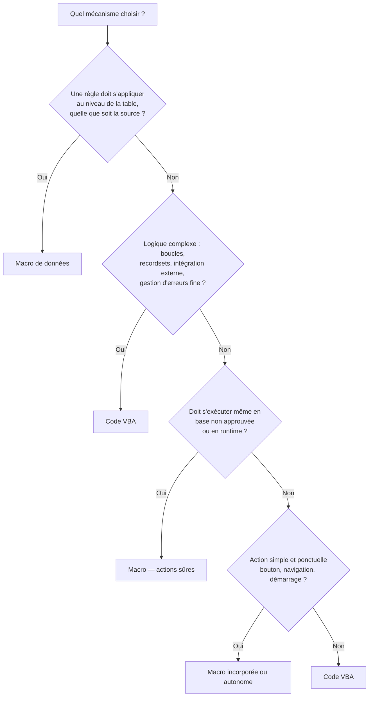

🔝 Retour au [Sommaire](/SOMMAIRE.md)

# 1.3. Macros Access vs code VBA — quand choisir quoi

La section 1.1 a situé les macros et le code VBA comme deux niveaux d'automatisation au sein d'Access ; la section 1.2 a rappelé qu'Access, contrairement à Excel, ne génère pas de VBA à l'enregistrement et que le mot « macro » y désigne un objet bien distinct. Il est temps de répondre à la question pratique : **face à un besoin donné, faut-il écrire une macro ou du code VBA ?**

La réponse n'est pas dogmatique. On a longtemps répété qu'il fallait « toujours préférer VBA » ; cette règle, héritée d'anciennes versions d'Access, mérite aujourd'hui d'être nuancée. Les macros ont beaucoup progressé, et certaines situations — sécurité, déclencheurs au niveau des tables — leur donnent même l'avantage. Cette section fournit les critères pour décider en connaissance de cause.

## Deux mécanismes d'automatisation, pas un duel

Avant tout, il faut sortir de l'idée d'un affrontement. Macros et VBA ne s'excluent pas : ce sont deux outils aux domaines de prédilection différents, et la plupart des applications Access bien conçues utilisent **les deux**. La bonne question n'est donc pas « lequel est supérieur ? », mais « lequel est le mieux adapté à *ce* besoin précis ? ».

## Que sont réellement les macros Access ?

Une macro Access est un objet composé d'**actions prédéfinies** que l'on assemble dans un concepteur visuel (le générateur de macros), sans écrire de code. Chaque action correspond à une opération standard : ouvrir un formulaire (`OuvrirFormulaire`), exécuter une requête, afficher un message (`ZoneMessage`), appliquer un filtre, atteindre un enregistrement, etc.

Il existe trois familles de macros, qu'il importe de distinguer :

- **Les macros autonomes.** Stockées dans le volet de navigation, elles portent un nom et peuvent être déclenchées de plusieurs manières. Cas particulier essentiel : la macro nommée **`AutoExec`**, exécutée automatiquement à l'ouverture de la base de données.
- **Les macros incorporées (embedded).** Rattachées directement à l'événement d'un formulaire, d'un état ou d'un contrôle (par exemple « Sur clic » d'un bouton), elles sont stockées *avec* l'objet hôte. Introduites avec Access 2007, elles ont considérablement amélioré la maintenabilité des macros.
- **Les macros de données (data macros).** Introduites avec Access 2010, elles sont rattachées non pas à l'interface mais aux **tables** elles-mêmes et se déclenchent sur des événements de données (avant modification, après insertion, après suppression…). Ce sont, en quelque sorte, les « déclencheurs » (triggers) d'Access. Nous y revenons plus loin, car elles changent la donne.

Les macros modernes disposent par ailleurs de fonctionnalités qui les rapprochent un peu de la programmation : blocs conditionnels `If / Else`, sous-macros nommées, variables temporaires partagées (`TempVars`, voir section 15.7), une gestion d'erreurs rudimentaire via l'action `SurErreur` et l'objet `MacroError`, et surtout l'action **`ExécuterCode` (RunCode)**, qui permet d'appeler une fonction VBA — un pont précieux entre les deux mondes.

## Ce que les macros savent faire — et leurs limites

Les macros excellent dans les automatisations **simples et directes** : ouvrir un objet, appliquer un filtre, afficher un message, lancer une requête, enchaîner quelques actions au démarrage. Pour ces besoins, elles sont rapides à mettre en place, lisibles, et accessibles à qui ne maîtrise pas la programmation.

Leurs limites apparaissent dès que la logique se complique :

- pas de véritables **boucles** générales ;
- pas de manipulation d'**enregistrements** par recordset (DAO/ADO) ;
- aucune **automation** d'autres applications (Excel, Word, Outlook) ni appel d'**API Windows** ;
- une gestion d'erreurs **rudimentaire** comparée à celle de VBA ;
- des possibilités de **réutilisation** restreintes ;
- un **débogage** sommaire.

En résumé, les macros couvrent bien le « simple », mais butent vite sur le « complexe ».

## Ce que VBA apporte en plus

À l'inverse, VBA offre la pleine puissance d'un langage de programmation : variables typées, structures de contrôle complètes (`If`, `Select Case`, boucles), gestion d'erreurs robuste (`On Error GoTo`, objet `Err`), accès complet aux données via DAO et ADO, automation des autres applications Office, appels d'API Windows, fonctions personnalisées réutilisables partout, et de véritables outils de débogage (points d'arrêt, exécution pas à pas, espions). Tout ce que la section 1.1 a décrit comme le rôle de VBA s'applique ici : c'est l'outil du « complexe » et de l'arbitraire.

## L'évolution des macros : un préjugé à dépasser

La mauvaise réputation des macros tient largement à l'histoire. Jusqu'à Access 2003, elles étaient effectivement très limitées : pas de macros incorporées, conditions exprimées dans une simple colonne, aucune macro de données, ni gestion d'erreurs ni variables temporaires. D'où le conseil, longtemps justifié, de « tout faire en VBA ».

Le tableau a changé en deux temps. **Access 2007** a apporté les macros incorporées, l'action de gestion d'erreurs `SurErreur` et les variables temporaires `TempVars` ; **Access 2010** y a ajouté les macros de données, les blocs `If / Else` et un générateur de macros entièrement repensé (sous-macros, IntelliSense). Les macros restent moins puissantes que VBA, mais elles ne sont plus le pis-aller d'autrefois. Garder à l'esprit cette évolution évite d'écarter par principe une solution parfois plus simple et tout à fait adaptée.

## La dimension sécurité : un critère décisif

C'est sans doute l'argument le moins connu et l'un des plus importants. Access distingue les actions selon leur dangerosité potentielle, et le comportement diffère lorsque la base **n'est pas approuvée** (hors emplacement de confiance, contenu non activé) :

- le **code VBA ne s'exécute pas** tant que la base n'est pas approuvée ;
- en revanche, un sous-ensemble d'**actions de macro réputées sûres** (ouvrir un formulaire ou un état, afficher un message, appliquer un filtre…) **continue de s'exécuter** même en mode restreint.

Conséquence pratique : pour qu'une opération s'exécute de façon fiable dans un environnement non maîtrisé — poste utilisateur sans emplacement de confiance configuré, déploiement en runtime —, une macro composée d'actions sûres peut être plus robuste qu'un code VBA bloqué par la sécurité. C'est typiquement le cas d'un `AutoExec` minimal au démarrage.

Une précision de cohérence s'impose ici : l'action `ExécuterCode` (RunCode), qui appelle du VBA, est elle-même considérée comme non sûre. Le pont « macro → VBA » ne fonctionne donc que dans une base approuvée. En environnement non approuvé, seules les **actions sûres pures** s'exécutent. Les paramètres de sécurité macro et le centre de gestion de la confidentialité sont détaillés en section 20.5.

## Le cas particulier des macros de données

Les macros de données méritent une attention spéciale, car elles offrent une capacité que **VBA ne possède pas**. Rattachées aux tables, elles se déclenchent au niveau du **moteur de base de données**, quelle que soit la manière dont les données sont modifiées : par un formulaire, par une requête action, lors d'un import, voire depuis une autre application via une table liée.

Une règle métier portée par un événement de formulaire (en VBA) ne s'applique qu'aux saisies *passant par ce formulaire*. Une règle portée par une macro de données s'applique **toujours**, sans contournement possible par une autre voie d'accès. Pour garantir l'intégrité au plus près de la donnée, les macros de données sont donc parfois non seulement préférables, mais carrément le **seul** bon outil. C'est un cas où la question « macro ou VBA ? » se tranche en faveur de la macro pour des raisons d'architecture, pas de simplicité.

## Maintenabilité, débogage et gestion de versions

Pour les applications de taille conséquente, et plus encore en équipe, plusieurs critères pratiques penchent nettement du côté de VBA :

- **Débogage.** VBA offre points d'arrêt, exécution pas à pas et fenêtre Espion (chapitre 19) ; les macros n'offrent qu'un débogage très limité.
- **Gestion de versions.** Le code VBA s'**exporte sous forme de texte** et se prête donc au suivi dans un outil comme Git (diff, historique, fusion ; voir section 24.4). Les macros, stockées dans un format moins propice à la comparaison ligne à ligne, sont plus délicates à versionner.
- **Modularité et réutilisation.** Les fonctions VBA placées dans des modules sont appelables depuis les requêtes, les formulaires, les états et d'autres procédures, ce qui favorise la factorisation. Les macros se réutilisent plus difficilement.

À l'inverse, pour une poignée d'actions triviales, écrire et maintenir une macro reste plus léger que de créer un module VBA. Chaque approche a son échelle de pertinence.

## Faire collaborer macros et VBA

En pratique, on combine souvent les deux. Le pont le plus courant est l'action **`ExécuterCode` (RunCode)**, qui invoque une **fonction** VBA (et non une procédure `Sub`). Un schéma classique consiste à utiliser un `AutoExec` qui délègue le démarrage réel à une fonction VBA :

```vba
' Fonction VBA appelée par la macro AutoExec via l'action ExécuterCode (RunCode)
Public Function DemarrerApplication() As Boolean
    DoCmd.OpenForm "frmMenuPrincipal"
    ' ... initialisations diverses (TempVars, vérifications, etc.) ...
    DemarrerApplication = True
End Function
```

Autre pratique répandue : confier les actions vraiment triviales (un bouton qui ouvre un formulaire) à une macro incorporée, et réserver VBA à tout ce qui porte de la logique. Enfin, Access propose un outil intégré pour **convertir des macros en code VBA**, utile lorsqu'une macro devenue trop complexe doit migrer vers du code ; cette conversion est traitée en section 2.7.

## Quand choisir quoi — guide de décision

Le schéma suivant résume la démarche de décision face à un besoin d'automatisation.



On peut le formuler aussi sous forme de repères :

| Privilégiez… | Quand… |
|---|---|
| Une **macro** (autonome ou incorporée) | automatisation simple et ponctuelle : bouton, navigation, `AutoExec` minimal, contexte sans code |
| Des **actions sûres** de macro | le traitement doit s'exécuter même hors zone approuvée ou en déploiement runtime |
| Une **macro de données** | une règle métier doit s'appliquer au niveau de la table, quelle que soit la voie d'accès |
| Du **VBA** | logique complexe, boucles, recordsets, intégration externe, gestion d'erreurs, réutilisation, gros projet, besoin de débogage et de gestion de versions |

## Tableau comparatif macros ↔ VBA

| Critère | Macros | VBA |
|---|---|---|
| Variables | `TempVars` (variables temporaires, non typées) | Variables typées complètes |
| Logique conditionnelle | Blocs `If / Else` (depuis 2010) | `If`, `Select Case`… |
| Boucles | Très limitées (pas de boucle générale) | `For`, `Do`, `While`… |
| Gestion d'erreurs | Action `SurErreur` + objet `MacroError` | `On Error GoTo / Resume`, objet `Err` |
| Manipulation d'enregistrements | Non (pas de recordsets) | DAO / ADO complets |
| Automation Office / API Windows | Non | Oui |
| Fonctions réutilisables | Limité (`ExécuterMacro`) | Modules, fonctions appelables partout |
| Débogage | Sommaire | Points d'arrêt, pas à pas, espions |
| Gestion de versions (texte / Git) | Difficile | Aisée (export texte) |
| Exécution sans base approuvée | Actions sûres : oui | Non |
| Déclencheurs au niveau des tables | Oui (macros de données) | Non |
| Courbe d'apprentissage | Faible | Plus élevée |

## À retenir

- Macros et VBA ne s'opposent pas : ce sont **deux niveaux d'automatisation complémentaires**, et la plupart des applications utilisent les deux.
- Les **macros** conviennent aux automatisations **simples et ponctuelles** ; **VBA** s'impose dès que la **logique se complexifie** (boucles, recordsets, intégration, gestion d'erreurs).
- Le vieux conseil « toujours VBA » est **dépassé** : enrichies en deux temps par Access 2007 (macros incorporées, gestion d'erreurs, `TempVars`) puis Access 2010 (macros de données, blocs `If / Else`), les macros sont aujourd'hui bien plus capables.
- Côté **sécurité**, les actions sûres de macro s'exécutent même en base non approuvée, là où **VBA est bloqué** — un argument réel en environnement non maîtrisé ou en runtime.
- Les **macros de données** offrent des déclencheurs **au niveau des tables** que VBA ne sait pas reproduire : parfois le seul bon choix pour garantir l'intégrité.
- Pour les **gros projets**, VBA l'emporte sur la **maintenabilité** (débogage, modularité, gestion de versions) ; l'action `ExécuterCode` permet de faire collaborer les deux approches.

---


⏭️ [1.4. Activation et paramétrage des options de développement](/01-introduction-vba-access/04-activation-options-developpement.md)
