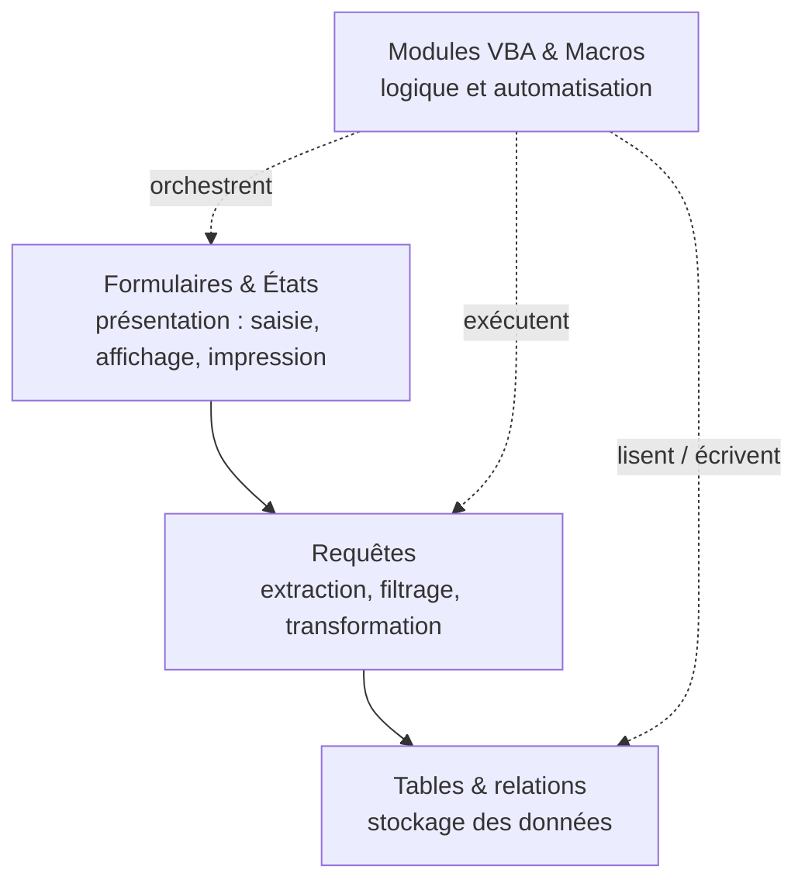

🔝 Retour au [Sommaire](/SOMMAIRE.md)

# 1.5. Structure d'une application Access (tables, requêtes, formulaires, états, modules)

Maintenant que l'environnement de développement est prêt, prenons de la hauteur : de quoi une application Access est-elle faite ? Comprendre sa structure — les différents types d'objets et la façon dont ils s'articulent — est indispensable avant d'écrire du code, car le VBA n'agit jamais dans le vide : il manipule ces objets, les pilote et les relie.

Une particularité d'Access, déjà évoquée, prend ici tout son sens : tout réside, par défaut, dans **un seul fichier**. Tables, requêtes, formulaires, états, macros et modules cohabitent au sein du même `.accdb`. C'est à la fois la base de données *et* l'application qui s'y trouvent réunies. (Les différents formats de fichiers sont étudiés en section 1.6.)

## Une application faite d'objets

Une application Access se compose de **six types d'objets** :

- les **tables**, qui stockent les données ;
- les **requêtes**, qui les interrogent et les transforment ;
- les **formulaires**, qui constituent l'interface ;
- les **états**, qui produisent les sorties imprimées ;
- les **macros**, pour l'automatisation simple ;
- les **modules**, qui hébergent le code VBA.

On peut les ranger en deux grandes catégories : les objets de **données** (tables, requêtes) et les objets d'**interface et de logique** (formulaires, états, macros, modules). Cette distinction recoupe la séparation données / présentation propre à toute base de données relationnelle, soulignée en section 1.2.

## Le volet de navigation

Tous ces objets sont rassemblés et organisés dans le **volet de navigation**, à gauche de la fenêtre Access. C'est le point d'entrée pour ouvrir, créer ou modifier un objet. On peut y regrouper les objets par type, par date, ou selon des catégories personnalisées — une organisation soignée du volet facilite grandement la maintenance d'une application un peu conséquente.

## Les tables : le socle des données

Les **tables** sont les seuls objets qui contiennent réellement des **données**. Chaque table décrit une entité (clients, commandes, produits…) sous forme de **champs** (colonnes typées) et d'**enregistrements** (lignes). On y définit une **clé primaire**, des **index** pour accélérer les recherches, ainsi que des **règles de validation** simples.

Les **relations** entre tables — établies dans la fenêtre des relations — font également partie de cette couche : elles définissent les liens (un client a plusieurs commandes) et permettent d'imposer l'**intégrité référentielle**. Tout le reste de l'application repose sur cette fondation.

Côté VBA, les tables se manipulent par programmation via **DAO** ou **ADO** (chapitres 9 et 10) : lecture, ajout, modification, suppression d'enregistrements. Leur **structure** elle-même (champs, index) est accessible et modifiable par code via les `TableDefs` (chapitre 12).

## Les requêtes : interroger et transformer

Les **requêtes** sont des questions enregistrées portant sur les données. Elles n'en stockent pas (le résultat est calculé **à la demande**) mais elles extraient, filtrent, trient, regroupent et combinent les données des tables.

On distingue principalement :

- les **requêtes sélection** (`SELECT`), qui renvoient un jeu d'enregistrements ;
- les **requêtes action** (`INSERT`, `UPDATE`, `DELETE`, création de table), qui modifient les données en lot ;
- des variantes comme les requêtes **paramétrées**, **analyses croisées** ou **union**.

Les requêtes jouent un rôle pivot : elles servent fréquemment de **source d'enregistrements** aux formulaires et aux états, et peuvent s'appuyer les unes sur les autres. En VBA, on les exécute (`DoCmd.OpenQuery`, `CurrentDb.Execute`), on les ouvre en recordset, et on peut les créer ou les modifier par code via les `QueryDefs` (chapitres 11 et 12).

## Les formulaires : l'interface de l'utilisateur

Les **formulaires** constituent l'interface par laquelle l'utilisateur consulte et saisit les données. Le plus souvent **liés** à une table ou à une requête (via la propriété `RecordSource`), ils affichent et mettent à jour automatiquement les données grâce à la liaison de leurs **contrôles** (`ControlSource`) — cette notion de liaison, propre à Access, a été présentée en section 1.2.

Au-delà de la saisie, les formulaires servent aussi de **menus**, de **boîtes de dialogue** et d'écrans de **navigation**. Chacun peut être assorti d'un **module de code** (le « code derrière le formulaire »), où l'on place les gestionnaires d'événements qui en pilotent le comportement. Les formulaires, leurs propriétés, leurs contrôles et leurs événements font l'objet des chapitres 6 et 8.

## Les états : la restitution imprimée

Les **états** sont l'équivalent des formulaires pour la **sortie** : affichage à l'écran, impression, ou export (PDF, RTF…). Liés eux aussi à une source de données, ils sont organisés en **sections** (en-tête et pied d'état, en-tête et pied de page, en-têtes et pieds de groupe, section de détail) qui structurent la mise en page.

On les emploie pour les factures, listes, bordereaux, états récapitulatifs avec totaux et regroupements. Comme les formulaires, ils possèdent un **module de code** et un jeu d'**événements** (ouverture, mise en forme, absence de données…). Les états sont traités au chapitre 7.

## Les macros : l'automatisation simple

Les **macros** sont des objets d'automatisation composés d'actions prédéfinies. Elles font partie intégrante de la structure d'une application — macros autonomes (dont l'`AutoExec` de démarrage), macros incorporées aux événements, et macros de données rattachées aux tables. Leur rôle, leurs capacités et le choix entre macro et VBA ont été détaillés en section 1.3.

## Les modules : le code VBA

Les **modules** sont le foyer du code VBA — le cœur de cette formation. On en distingue plusieurs natures :

- les **modules standard**, qui contiennent des procédures et fonctions générales, **partagées** dans toute l'application ;
- les **modules de classe**, qui définissent des objets personnalisés (chapitre 16) ;
- les **modules de formulaire et d'état**, qui sont des modules de classe **attachés** à un formulaire ou à un état, et qui hébergent ses gestionnaires d'événements.

Les différents types de modules sont précisés en section 2.3. Retenez ici l'essentiel : c'est dans les modules que vit la logique programmée de l'application.

## Comment ces objets s'articulent — une vision en couches

Ces objets ne sont pas juxtaposés au hasard : ils forment un **empilement logique**. Les données circulent du bas vers le haut — des tables vers les requêtes, puis des requêtes vers les formulaires et les états — tandis que le code VBA (et, plus modestement, les macros) intervient transversalement pour orchestrer l'ensemble.

Cette **architecture en couches** — données, accès/transformation, présentation, logique — est un fil rouge de toute application bien conçue. Le chapitre 16 (section 16.8) montre comment la formaliser davantage (séparation DAL / BLL / UI) dans des applications d'envergure.

## Où se situe VBA dans cette structure

Si les modules sont la « maison » du VBA, son influence ne s'y limite pas : le code **traverse** toutes les couches. Il lit et écrit dans les **tables** (DAO/ADO), il **exécute** des requêtes, il **ouvre et pilote** les formulaires et les états, réagit à leurs **événements**, et peut même **créer ou modifier** des objets par programmation. VBA est ainsi le ciment qui relie des objets par ailleurs autonomes — c'est exactement le rôle d'orchestration décrit en section 1.1.

## Front-end / back-end : la structure en production

Un dernier aspect structurel mérite d'être connu dès maintenant, même s'il sera approfondi plus loin. En exploitation, on ne distribue généralement pas un fichier unique : on **scinde** l'application en deux.

- Un **back-end** : un fichier ne contenant que les **tables** (les données partagées), placé sur le réseau.
- Un **front-end** : un fichier contenant tout le reste (requêtes, formulaires, états, macros, modules), **copié sur chaque poste** et relié aux tables du back-end par des **tables liées**.

Cette séparation améliore la fiabilité, les performances et la maintenance en environnement multi-utilisateur. Elle est traitée en détail au chapitre 15 (architecture multi-utilisateurs) et au chapitre 21 (déploiement).

## Tableau récapitulatif des objets

| Objet | Rôle principal | Contient des données ? | Lien avec VBA |
|---|---|---|---|
| **Table** | Stocke et structure les données | Oui (les seules) | Manipulable via DAO/ADO ; structure via `TableDefs` |
| **Requête** | Extrait, filtre, transforme (à la demande) | Non | Exécutable et modifiable par code (`QueryDefs`) |
| **Formulaire** | Saisie et interaction | Non (affiche les données liées) | Module de code intégré + événements |
| **État** | Restitution et impression | Non (affiche les données liées) | Module de code intégré + événements |
| **Macro** | Automatisation par actions | Non | Pont via `ExécuterCode` (voir 1.3) |
| **Module** | Héberge le code VBA | Non | C'est le code lui-même |

## À retenir

- Une application Access est un assemblage de **six types d'objets** — tables, requêtes, formulaires, états, macros, modules — réunis, par défaut, dans **un seul fichier**.
- On les répartit en objets de **données** (tables, requêtes) et objets d'**interface et de logique** (formulaires, états, macros, modules) ; **seules les tables contiennent les données**.
- Ces objets s'organisent en **couches** : les données circulent des tables vers les requêtes, puis vers les formulaires et les états.
- Les **modules** sont le foyer du code VBA, mais ce dernier **traverse toutes les couches** : il lit/écrit les tables, exécute les requêtes et pilote l'interface.
- En production, l'application est souvent **scindée** en un back-end (les tables) et un front-end (tout le reste), reliés par des tables liées.

---

⏭️ [1.6. Formats de fichiers Access (.accdb, .accde, .accdr, .mdb) — différences et usages](/01-introduction-vba-access/06-formats-fichiers-access.md)
