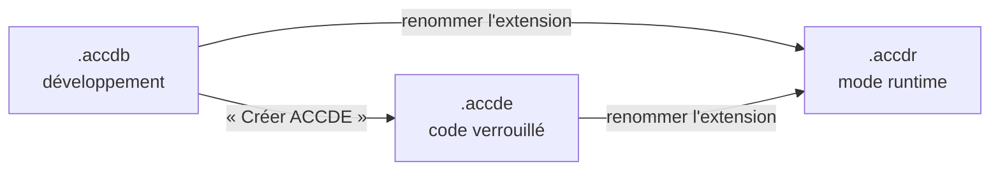

🔝 Retour au [Sommaire](/SOMMAIRE.md)

# 1.6. Formats de fichiers Access (.accdb, .accde, .accdr, .mdb) — différences et usages

La section précédente l'a rappelé : une application Access réside, par défaut, dans un seul fichier. Mais ce fichier peut prendre plusieurs **formats**, chacun adapté à un usage précis : développer, protéger le code, distribuer une application, ou assurer la compatibilité avec d'anciennes versions. Bien les distinguer évite des erreurs coûteuses — comme livrer par mégarde un fichier dont le code reste éditable, ou perdre l'unique source modifiable d'une application.

## Le moteur derrière les formats : ACE et Jet

Avant les extensions, un mot sur le moteur de base de données qui se cache derrière. Depuis Access 2007, le format moderne `.accdb` (et ses dérivés) repose sur le moteur **ACE** (*Access Connectivity Engine*). L'ancien format `.mdb`, lui, s'appuie sur le moteur **Jet** (*Joint Engine Technology*). Cette différence, déjà évoquée en section 1.1, explique pourquoi certaines fonctionnalités récentes (champs multivalués, champs Pièce jointe, macros de données) n'existent que dans la famille `.accdb`.

## `.accdb` — le format de travail standard

Le `.accdb` est le **format par défaut** des bases créées avec les versions actuelles d'Access, et c'est dans ce format que l'on **développe**. Il contient tous les objets de l'application (tables, requêtes, formulaires, états, macros, modules) **et le code VBA sous forme source**, donc consultable et modifiable. Il prend en charge l'ensemble des fonctionnalités modernes du moteur ACE.

C'est le format de référence : sauf cas particulier, on conçoit, modifie et maintient toujours son application au format `.accdb`. Les autres formats en sont, pour l'essentiel, des **dérivés** destinés à la distribution.

## `.accde` — la version compilée et verrouillée

Le `.accde` est une version **compilée** d'un `.accdb`, produite via la commande **« Créer ACCDE »** (*Fichier > Enregistrer sous > Enregistrer la base de données sous*). Ses caractéristiques :

- le **code VBA source est supprimé** ; seule subsiste sa forme compilée, **impossible à consulter ou à modifier** ;
- on ne peut **plus modifier la conception** des formulaires, des états et des modules, ni en créer de nouveaux ;
- en revanche, **les données restent pleinement exploitables** et l'application fonctionne normalement.

On l'utilise pour **protéger la propriété intellectuelle** (masquer le code) et pour **empêcher les modifications accidentelles** lors de la distribution. Point crucial : la transformation est **à sens unique**. On ne peut pas reconstituer un `.accdb` à partir d'un `.accde` ; il faut donc **toujours conserver précieusement le `.accdb` source**, faute de quoi l'application devient impossible à faire évoluer. La compilation en ACCDE est détaillée en section 20.3.

> 💡 La lettre finale renseigne sur la nature du fichier : **b** comme *database*, **e** comme *executable* (compilé), **r** comme *runtime*.

## `.accdr` — le mode runtime par l'extension

Le `.accdr` est plus subtil : il ne s'agit pas d'une compilation distincte, mais d'un **mode d'ouverture** déclenché par l'extension. Renommer un `.accdb` (ou un `.accde`) en `.accdr` force Access à l'ouvrir en **mode runtime**, même sur un poste équipé de la version complète d'Access.

En mode runtime, l'**environnement de conception est masqué** : pas de volet de navigation, ruban réduit, vues conception indisponibles, touches spéciales désactivées. L'application se comporte comme une application livrée. L'opération est **réversible** : il suffit de renommer le fichier en `.accdb` (ou `.accde`) pour retrouver l'environnement complet.

Ce format sert donc à **distribuer une application avec une expérience « runtime »**, indépendamment de l'installation d'Access sur le poste cible. Le sujet est approfondi au chapitre 21 (déploiement et Access Runtime).

## `.mdb` — le format hérité (Jet)

Le `.mdb` est le format historique d'Access, standard jusqu'à la version 2003 incluse, et toujours **ouvrable** dans les versions récentes. Reposant sur le moteur **Jet**, il **ne prend pas en charge** les fonctionnalités propres à ACE (champs multivalués, pièces jointes, macros de données).

Il conserve toutefois une pertinence dans quelques cas précis :

- **compatibilité** avec d'anciennes applications ou d'anciens postes ;
- **sécurité au niveau utilisateur** (groupes de travail, fichiers `.mdw`), un modèle disponible uniquement au format `.mdb` et abandonné dans `.accdb` (voir l'historique en section 20.1) ;
- **réplication** de base, autre mécanisme propre à l'ère Jet.

Son équivalent compilé est le `.mde` (analogue du `.accde` pour le monde Jet).

## Quelques formats et fichiers connexes

Au-delà des quatre formats principaux, on rencontre :

- **`.mde`** — version compilée d'un `.mdb` (équivalent hérité du `.accde`) ;
- **`.accdt`** — modèle de base de données Access (*template*) ;
- **`.accdc`** — package Access **signé** numériquement, pour une distribution sécurisée (voir section 20.4) ;
- les **fichiers de verrouillage** `.laccdb` (pour `.accdb`) et `.ldb` (pour `.mdb`) : créés automatiquement à côté de la base ouverte, ils gèrent les informations de verrouillage en multi-utilisateur. On ne les choisit pas — ils accompagnent simplement l'ouverture du fichier (voir chapitre 15).

Notez aussi que les bases `.accdb` et `.mdb` sont soumises à une **limite de taille de 2 Go** ; les stratégies de contournement sont abordées en section 18.9.

## Quel format choisir — selon l'usage

Le choix se résume à quelques règles simples.

- Pour **développer et maintenir** : `.accdb`. C'est le seul format réellement modifiable, et la **source à conserver** en toutes circonstances.
- Pour **distribuer en protégeant le code** et en figeant la conception : `.accde`.
- Pour **distribuer une application en mode runtime** : `.accdr` (obtenu par simple renommage d'un `.accdb` ou d'un `.accde`).
- Pour la **compatibilité héritée** ou le besoin de **sécurité par groupe de travail** : `.mdb`.

Cette logique se combine avec l'architecture **front-end / back-end** vue en section 1.5 : le **back-end** (les tables) reste typiquement un `.accdb` ordinaire, tandis que le **front-end** (l'application) est ce que l'on compile en `.accde` et/ou que l'on exécute en `.accdr` pour le déploiement.

**La règle d'or** : ne distribuez jamais votre `.accdb` de développement. Distribuez-en une copie dérivée (`.accde` / `.accdr`), et gardez l'original en lieu sûr — c'est lui, et lui seul, qui vous permettra de corriger et faire évoluer l'application.

## Tableau comparatif des formats

| Format | Moteur | Code VBA | Modifs de conception | Données | Usage principal |
|---|---|---|---|---|---|
| **.accdb** | ACE | Éditable (source) | Oui | Oui | Développement — format standard |
| **.accde** | ACE | Supprimé (compilé) | Non (formulaires, états, modules) | Oui | Distribution : protéger le code |
| **.accdr** | ACE | Identique au fichier source | Non (environnement masqué) | Oui | Distribution : expérience runtime |
| **.mdb** | Jet | Éditable (source) | Oui | Oui | Compatibilité héritée, sécurité par groupe de travail |

## À retenir

- Le `.accdb` (moteur **ACE**) est le **format de travail standard** : il contient tout, code VBA **éditable** compris, et c'est la **source à conserver**.
- Le `.accde` est une version **compilée** : code source **supprimé**, conception verrouillée, données toujours exploitables — transformation **irréversible**.
- Le `.accdr` n'est pas une compilation mais un **mode runtime** déclenché par l'extension, **réversible** par simple renommage.
- Le `.mdb` (moteur **Jet**) est le **format hérité**, encore utile pour la compatibilité et la **sécurité par groupe de travail**, mais privé des fonctionnalités modernes d'ACE.
- **Règle d'or** : on développe en `.accdb` et on conserve toujours cette source ; on ne distribue que des dérivés (`.accde` / `.accdr`).

---

> ✅ **Fin du chapitre 1.** La suite se poursuit avec le chapitre 2 — Interface et environnement de développement

⏭️ [2. Interface et environnement de développement](/02-interface-environnement/README.md)
