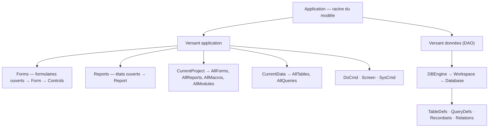

🔝 Retour au [Sommaire](/SOMMAIRE.md)

# 4.1. Vue d'ensemble de la hiérarchie des objets Access

Le chapitre s'ouvre, logiquement, par une **vue d'ensemble**. Avant d'examiner chaque objet en détail dans les sections suivantes, il est précieux de disposer d'une **carte** : comment ces objets s'emboîtent, par où l'on y accède, et comment on circule de l'un à l'autre. Cette section fournit cette carte ; les branches qu'elle esquisse seront ensuite parcourues une à une.

## Un modèle en arbre

Le modèle objet d'Access s'organise comme un **arbre** : les objets en contiennent d'autres, le plus souvent par l'intermédiaire de **collections** (vues aux sections 3.2 et 3.7). On descend ainsi d'un objet **parent** vers une **collection**, puis vers un objet **enfant**, et ainsi de suite. À la racine de tout se trouve l'objet **`Application`**.

Comme l'a posé l'introduction du chapitre, cet arbre réunit en réalité **deux versants** complémentaires : le versant **application** (interface et pilotage) et le versant **données** (le modèle DAO). Tous deux partent de `Application`, ce dernier exposant le modèle DAO via son objet `DBEngine`.

## La carte générale

Le schéma suivant donne la vue d'ensemble. Il est volontairement simplifié : chaque branche sera détaillée dans les sections indiquées.



En résumé, on y trouve :

- l'objet **`Application`**, racine de l'ensemble — détaillé en section 4.2 ;
- les collections **`Forms`** et **`Reports`**, qui regroupent les formulaires et états **ouverts** (chapitres 6 et 7) ;
- **`CurrentProject`** et **`CurrentData`**, conteneurs des objets de l'application courante (section 4.3) et leurs collections **`All…`** (section 4.4) ;
- **`DoCmd`**, l'objet d'automatisation, suffisamment important pour avoir son propre chapitre (chapitre 5) ;
- les objets utilitaires **`Screen`** et **`SysCmd`** (section 4.7) ;
- le modèle **DAO**, avec **`DBEngine`**, **`Workspace`** et **`Database`** (sections 4.5 et 4.6).

## Naviguer dans la hiérarchie

### La notation pointée

On circule dans l'arbre avec la **notation pointée**, en descendant de proche en proche :

```vba
' Du formulaire ouvert "frmClients", jusqu'à la valeur d'un contrôle
Forms("frmClients").Controls("txtNom").Value = "Dupont"
```

L'objet `Application` étant la racine, il est **implicite** dans le code Access : on écrit `Forms` plutôt que `Application.Forms`. Les deux formes sont équivalentes :

```vba
Debug.Print Forms.Count
Debug.Print Application.Forms.Count   ' identique
```

### Accéder à un membre de collection

Un membre d'une collection s'atteint de trois façons : par son **indice**, par son **nom**, ou avec l'opérateur **`!`** (« bang ») :

```vba
Debug.Print Forms(0).Name              ' par indice (la collection Forms est à base 0)
Debug.Print Forms("frmClients").Name   ' par nom
Debug.Print Forms!frmClients.Name      ' notation « ! »
```

La distinction entre **`.`** et **`!`** mérite d'être retenue, car elle revient tout au long de la formation : le **point** (`.`) accède à une **propriété ou une méthode** définie par le type de l'objet, tandis que le **point d'exclamation** (`!`) accède à un **élément nommé** de la collection par défaut de l'objet — un formulaire dans `Forms`, un contrôle sur un formulaire, un champ dans un recordset. Ainsi, `Forms!frmClients` équivaut à `Forms("frmClients")`.

### Parcourir avec For Each

Puisque ces collections sont… des collections, on les parcourt naturellement avec `For Each` (section 3.2) :

```vba
Dim frm As Form
For Each frm In Forms                  ' tous les formulaires ouverts
    Debug.Print frm.Name
Next frm
```

## Les deux versants se rejoignent

C'est l'un des points clés de ce chapitre. Le versant **application** et le versant **données** offrent chacun un point d'entrée vers l'application courante :

```vba
' Versant application : le projet courant
Debug.Print CurrentProject.Name

' Versant données : la base de données courante (DAO)
Debug.Print CurrentDb.Name
```

`CurrentProject` (section 4.3) donne accès aux objets de l'application — formulaires, états, macros, modules — tandis que `CurrentDb` (sections 4.5 et 4.6) ouvre la porte du moteur de données. Comprendre que ces deux chemins coexistent, et savoir lequel emprunter selon le besoin, est l'essence même de ce chapitre.

## Objets ouverts ou objets existants

Une dernière distinction, importante et souvent négligée, se lit déjà sur la carte. Certaines collections ne contiennent que les objets **actuellement ouverts**, d'autres **tous les objets existants** :

```vba
Debug.Print Forms.Count                      ' formulaires OUVERTS uniquement
Debug.Print CurrentProject.AllForms.Count    ' TOUS les formulaires (ouverts ou non)
```

La collection `Forms` ne « voit » que ce qui est ouvert à l'instant T ; pour énumérer l'ensemble des formulaires d'une base, il faut passer par `CurrentProject.AllForms`. Cette différence, source d'erreurs classiques, est développée en section 4.4.

## Repères pour la suite du chapitre

Cette vue d'ensemble se déploie ainsi dans les sections suivantes :

| Branche | Section |
|---|---|
| L'objet `Application` (racine) | 4.2 |
| `CurrentProject` et `CurrentData` | 4.3 |
| Les collections `All…` (objets existants) | 4.4 |
| Le modèle DAO (`DBEngine`, `Workspace`, `Database`) | 4.5 |
| `CurrentDb()` vs `DBEngine(0)(0)` | 4.6 |
| Les utilitaires `Screen` et `SysCmd` | 4.7 |
| L'objet `DoCmd` | chapitre 5 |

## À retenir

- Le modèle objet d'Access est un **arbre** dont la racine est l'objet **`Application`** (implicite dans le code), réunissant un **versant application** et un **versant données (DAO)**.
- On navigue par la **notation pointée** ; un membre de collection s'atteint par **indice**, par **nom** ou avec l'opérateur **`!`** (`Forms!frmClients` = `Forms("frmClients")`).
- Le **point** (`.`) accède à une propriété/méthode du type ; le **bang** (`!`) accède à un **élément nommé** de la collection par défaut — distinction récurrente dans toute la formation.
- Les deux versants se rejoignent via **`CurrentProject`** (application) et **`CurrentDb`** (données) : savoir lequel utiliser est l'enjeu du chapitre.
- Attention à la différence entre objets **ouverts** (`Forms`) et objets **existants** (`CurrentProject.AllForms`), détaillée en section 4.4.

---


⏭️ [4.2. L'objet Application](/04-modele-objet-access/02-objet-application.md)
