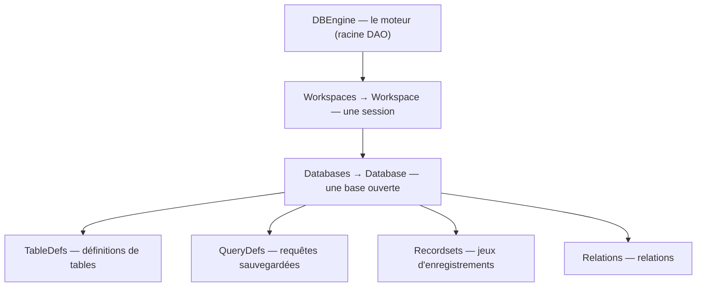

🔝 Retour au [Sommaire](/SOMMAIRE.md)

# 4.5. DBEngine, Workspace et Database (DAO)

Le chapitre bascule à présent du versant application au versant **données**, avec le modèle **DAO** (*Data Access Objects*). Cette section en présente le **sommet** — les objets `DBEngine`, `Workspace` et `Database` —, c'est-à-dire la chaîne qui mène jusqu'à la base de données. Il s'agit d'une vue **structurelle** : les opérations concrètes sur les données (recordsets, requêtes, structure des tables) sont l'objet des chapitres 9, 11 et 12. Rappelons que DAO est **référencé par défaut** dans une base `.accdb` (section 2.5).

## La hiérarchie DAO en bref

DAO s'organise, lui aussi, en arbre. Trois niveaux mènent jusqu'à la base ouverte, qui donne ensuite accès aux tables, requêtes et enregistrements.



## DBEngine : la racine du moteur

**`DBEngine`** est l'objet **racine** de DAO : il représente le moteur de base de données lui-même (ACE pour les `.accdb`, Jet pour les `.mdb` — section 1.6). C'est un objet unique, au sommet de toute la hiérarchie de données, et il est accessible **directement** dans le code Access.

Ses membres les plus notables :

- la collection **`Workspaces`** (ses sessions) ;
- la collection **`Errors`**, qui recueille les erreurs DAO (section 13.5) ;
- la propriété **`Version`** (version du moteur) ;
- des méthodes comme **`CreateWorkspace`**, **`OpenDatabase`** ou **`CompactDatabase`** (compactage par code, section 18.7).

```vba
Debug.Print DBEngine.Version          ' version du moteur DAO
Debug.Print DBEngine.Workspaces.Count ' nombre d'espaces de travail
```

## Workspace : une session du moteur

Un **`Workspace`** (espace de travail) représente une **session** du moteur : un contexte dans lequel on ouvre des bases et l'on gère des **transactions**. À l'ouverture d'Access, un espace de travail **par défaut** est créé automatiquement : c'est **`DBEngine.Workspaces(0)`**.

```vba
Dim ws As DAO.Workspace
Set ws = DBEngine.Workspaces(0)       ' l'espace de travail par défaut
Debug.Print ws.Name                   ' "#Default Workspace#"
```

Dans la grande majorité des cas, on utilise cet espace par défaut **sans même y penser**. On ne crée un espace de travail explicite que pour des besoins particuliers — notamment la gestion des **transactions** (`BeginTrans`, `CommitTrans`, `Rollback`), détaillée au chapitre 14, ou l'ouverture d'une base externe.

## Database : la base de données ouverte

L'objet **`Database`** représente une **base ouverte**. C'est la **porte d'accès aux données** : à partir de lui, on atteint les tables, les requêtes, et l'on ouvre des recordsets.

Ses membres clés :

- les collections **`TableDefs`** (définitions de tables) et **`QueryDefs`** (requêtes sauvegardées), manipulées au chapitre 12 ;
- la collection **`Relations`** (section 12.6) ;
- la méthode **`OpenRecordset`**, qui ouvre un jeu d'enregistrements (le véritable cheval de bataille, chapitre 9) ;
- la méthode **`Execute`**, qui exécute des requêtes action SQL (chapitre 11) ;
- des méthodes de création (`CreateTableDef`, `CreateQueryDef`, `CreateRelation`…) traitées au chapitre 12.

```vba
Dim db As DAO.Database
Set db = CurrentDb
Debug.Print db.Name                   ' chemin complet de la base
Debug.Print db.TableDefs.Count        ' nombre de tables (tables système comprises)

' La base est la porte d'accès aux données :
Dim rs As DAO.Recordset
Set rs = db.OpenRecordset("tblClients")            ' ouvrir un recordset (chapitre 9)
db.Execute "DELETE FROM tblTemp", dbFailOnError    ' exécuter du SQL (chapitre 11)
```

> ℹ️ La collection `TableDefs` inclut les **tables système** (masquées, préfixées `MSys`) : son décompte est donc supérieur au nombre de tables visibles par l'utilisateur. Ce point est précisé en section 12.4.

## Les raccourcis de notation : DBEngine(0)(0)

On rencontre souvent l'écriture compacte **`DBEngine(0)(0)`**. Elle s'explique par les **collections par défaut** : `Workspaces` est la collection par défaut de `DBEngine`, et `Databases` celle de `Workspace`. Par conséquent :

- `DBEngine(0)` équivaut à `DBEngine.Workspaces(0)` ;
- `DBEngine(0)(0)` équivaut à `DBEngine.Workspaces(0).Databases(0)`.

```vba
' Ces trois écritures désignent le même objet :
Debug.Print DBEngine(0)(0).Name
Debug.Print DBEngine.Workspaces(0).Databases(0).Name
```

C'est le même mécanisme de collection par défaut que celui rencontré avec l'opérateur `!` (section 4.1), appliqué ici par indice.

## Atteindre la base courante : deux chemins

Il existe **deux façons** d'obtenir un objet `Database` pointant sur la base de données courante :

- **`CurrentDb()`** — une méthode de `Application` ;
- **`DBEngine(0)(0)`** — la base déjà présente dans l'espace de travail par défaut.

```vba
Dim db1 As DAO.Database, db2 As DAO.Database
Set db1 = CurrentDb            ' un chemin
Set db2 = DBEngine(0)(0)       ' l'autre chemin
```

Ces deux chemins **ne sont pas équivalents**, et leur différence — discrète mais lourde de conséquences — est l'une des causes de bugs les plus classiques sous Access. Elle fait l'objet de la **section suivante (4.6)**, qu'il est vivement conseillé de lire attentivement.

## À retenir

- DAO s'organise en hiérarchie : **`DBEngine`** (le moteur) → **`Workspace`** (une session) → **`Database`** (une base ouverte) → tables, requêtes, recordsets, relations.
- **`DBEngine`** est la racine du modèle de données (accessible directement) ; il expose les `Workspaces`, la collection **`Errors`** (section 13.5) et des méthodes comme `CompactDatabase` (section 18.7).
- On travaille presque toujours avec l'**espace de travail par défaut** `Workspaces(0)` ; on n'en crée un explicite que pour les **transactions** (chapitre 14) ou des bases externes.
- L'objet **`Database`** est la **porte d'accès aux données** : `OpenRecordset` (chapitre 9), `Execute` (chapitre 11), `TableDefs`/`QueryDefs` (chapitre 12).
- **`DBEngine(0)(0)`** = `DBEngine.Workspaces(0).Databases(0)` (collections par défaut) ; deux chemins mènent à la base courante (`CurrentDb()` et `DBEngine(0)(0)`), **mais ils diffèrent** — voir la section 4.6.

---


⏭️ [4.6. CurrentDb() vs DBEngine(0)(0) — différences et cas d'usage](/04-modele-objet-access/06-currentdb-vs-dbengine.md)
