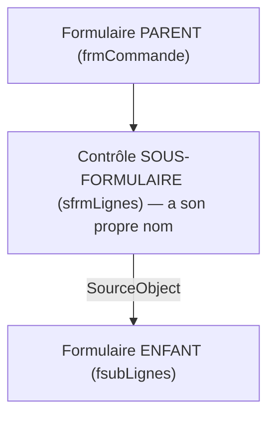

🔝 Retour au [Sommaire](/SOMMAIRE.md)

# 6.4. Sous-formulaires — liaison parent/enfant et propriété LinkMasterFields

Les sous-formulaires mettent en œuvre le motif **maître/détail** (parent/enfant), l'un des plus courants dans les applications de gestion : une commande et ses lignes, un client et ses commandes. Cette section explique comment les lier — automatiquement, via `LinkMasterFields` et `LinkChildFields` — et comment les **référencer** dans les deux sens, en reprenant le pont `.Form` entrevu en section 6.2.

## Qu'est-ce qu'un sous-formulaire ?

Un sous-formulaire est un formulaire **imbriqué** dans un autre, affiché à travers un **contrôle sous-formulaire** posé sur le formulaire parent. L'usage canonique est le couple **« un »/« plusieurs »** : un formulaire parent affiche un enregistrement (la commande), tandis que le sous-formulaire affiche les enregistrements liés (les lignes de la commande).

Comme vu en section 6.3, le parent est généralement en mode **simple**, et le sous-formulaire en **feuille de données** ou en **continu** pour montrer plusieurs lignes.

## Trois objets à distinguer

Première source de confusion : il y a **trois** objets en jeu, qu'il ne faut pas mélanger.



- le **formulaire parent** (l'enveloppe extérieure) ;
- le **contrôle sous-formulaire** : le conteneur posé sur le parent, qui possède **son propre nom** et dont la propriété **`SourceObject`** désigne le formulaire affiché ;
- le **formulaire enfant** : celui qui s'affiche à l'intérieur.

> ⚠️ **Le nom du contrôle sous-formulaire peut différer du nom du formulaire enfant.** Lorsqu'on glisse un formulaire sur un autre, le contrôle prend souvent le même nom, mais il peut être renommé. **Toutes les références passent par le nom du contrôle**, pas par celui du formulaire — une erreur très fréquente.

## La liaison automatique : LinkMasterFields / LinkChildFields

La synchronisation entre parent et enfant repose sur **deux propriétés du contrôle sous-formulaire** :

- **`LinkMasterFields`** : le ou les champs du **parent** qui pilotent la liaison ;
- **`LinkChildFields`** : le ou les champs **correspondants** côté enfant.

Une fois ces propriétés renseignées, Access **filtre automatiquement** le sous-formulaire pour n'afficher que les enregistrements enfants correspondant au parent courant, et **renseigne automatiquement** le champ de liaison dans les nouveaux enregistrements enfants. Tout cela **sans la moindre ligne de code** : c'est la magie du maître/détail.

```vba
' Propriétés du CONTRÔLE sous-formulaire (réglées en conception, ou par code)
Me!sfrmLignes.LinkMasterFields = "CommandeID"   ' champ du parent
Me!sfrmLignes.LinkChildFields = "CommandeID"    ' champ correspondant de l'enfant
```

Pour une liaison sur **plusieurs champs** (clé composite), on les sépare par des **points-virgules**. Ces propriétés se définissent le plus souvent en conception, mais peuvent l'être par code pour des scénarios dynamiques.

## Référencer dans les deux sens

C'est ici que se prolonge le pont `.Form` de la section 6.2. Le référencement va dans les **deux sens**.

### Du parent vers l'enfant : .Form

Depuis le code du **parent**, on atteint un contrôle de l'enfant en passant par le **contrôle sous-formulaire** puis par **`.Form`** :

```vba
' Depuis le PARENT : un contrôle du sous-formulaire
Me!sfrmLignes.Form!txtQuantite = 5
Me!sfrmLignes.Form.Requery              ' actualiser le sous-formulaire
```

Rappel : `sfrmLignes` est le **nom du contrôle**, et `.Form` fait le pont vers l'objet `Form` imbriqué. Sans `.Form`, la référence échoue.

### De l'enfant vers le parent : .Parent

Inversement, depuis le code de l'**enfant**, on atteint le parent via la propriété **`Parent`** (rencontrée en section 6.1) :

```vba
' Depuis l'ENFANT : un contrôle du parent
Me.Parent!txtTotal = Me.Parent!txtTotal + Me!txtMontant
Debug.Print Me.Parent.Name
```

Cette double voie — `.Form` pour **descendre** (parent → enfant), `.Parent` pour **remonter** (enfant → parent) — est à mémoriser : elle revient constamment dès qu'on travaille avec des sous-formulaires.

## Actions courantes

Deux opérations reviennent souvent.

**Actualiser le sous-formulaire** après avoir ajouté ou modifié une ligne (par exemple recalculer la liste des lignes depuis le parent) :

```vba
Me!sfrmLignes.Form.Requery
```

**Changer dynamiquement le formulaire affiché**, en modifiant `SourceObject` — utile pour proposer plusieurs vues dans un même contrôle conteneur :

```vba
Me!sfrmZone.SourceObject = "fsubAutreVue"   ' afficher un autre formulaire
Me!sfrmZone.SourceObject = ""               ' vider le sous-formulaire
```

## Pièges et précisions

- **Nom du contrôle ≠ nom du formulaire** : on référence toujours par le **contrôle** (point déjà souligné).
- **`.Form` obligatoire** pour passer du contrôle sous-formulaire au formulaire enfant (section 6.2).
- **Ordre des événements** : à l'ouverture, les événements du **sous-formulaire** se déclenchent selon un ordre précis par rapport à ceux du parent (le sous-formulaire se charge en premier) — sujet traité avec le cycle de vie au chapitre 8 (section 8.7). Cela a son importance si du code du parent dépend du sous-formulaire (ou l'inverse) au démarrage.
- **Sous-formulaires imbriqués** : on peut imbriquer plusieurs niveaux ; la référence s'allonge alors d'autant (`…ctrlSF1.Form!ctrlSF2.Form!champ`).

## À retenir

- Un sous-formulaire implémente le motif **maître/détail** : un parent en mode simple, un enfant (souvent en feuille de données) affichant les lignes liées.
- **Trois objets à distinguer** : le **formulaire parent**, le **contrôle sous-formulaire** (avec son **propre nom** et sa propriété `SourceObject`) et le **formulaire enfant** — les références passent par le **nom du contrôle**.
- **`LinkMasterFields`** (champ parent) et **`LinkChildFields`** (champ enfant) **synchronisent automatiquement** parent et enfant, **sans code** (points-virgules pour plusieurs champs).
- Référencement bidirectionnel : **`.Form`** pour descendre du parent vers l'enfant, **`.Parent`** pour remonter de l'enfant vers le parent.
- Actions courantes : **`Requery`** du sous-formulaire, et changement de **`SourceObject`** pour afficher dynamiquement un autre formulaire ; attention à l'**ordre des événements** au démarrage (section 8.7).

---


⏭️ [6.5. RecordSource dynamique et filtres par code](/06-formulaires/05-recordsource-filtres-dynamiques.md)
